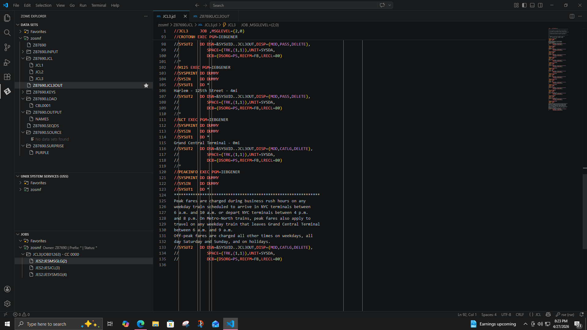
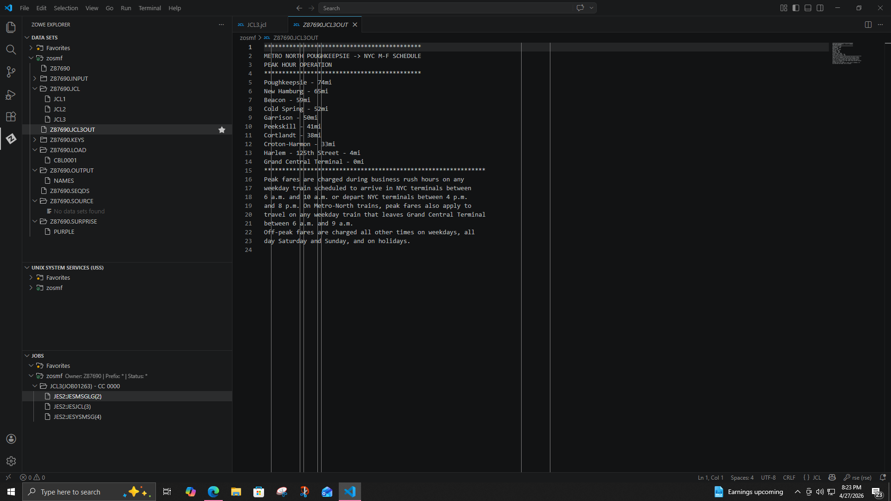
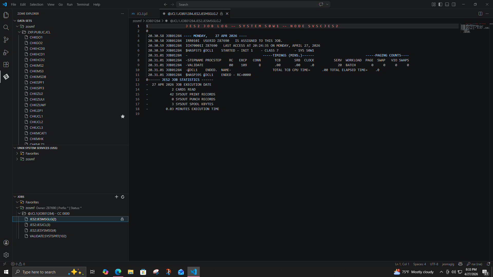

# ibm-zos-jcl-exercises
Hands-on IBM z/OS JCL exercises covering dataset management, IEBGENER utility, COBOL job execution, and JES job debugging.

## 📌 Overview

This project demonstrates hands-on experience with IBM z/OS Job Control Language (JCL), including dataset management, utility execution, COBOL integration, and job debugging using JES logs.

---

## 🛠️ Technologies

* IBM z/OS
* JCL (Job Control Language)
* IEBGENER Utility
* COBOL (compile & run)
* JES2 Job Management

---

## 🔄 Workflow

### 1. Copy Jobs Using IEBGENER (JCL1)

* Copied JCL members into personal dataset
* Learned strict DD requirements:

  * SYSUT1 (input)
  * SYSUT2 (output)
  * SYSIN (control)
  * SYSPRINT (messages)

---

### 2. Compile and Run COBOL (JCL2)

* Compiled COBOL program using `IGYWCL`
* Fixed runtime error caused by DD mismatch:

  ```
  COMBINE → COMBINED
  ```

---

### 3. Build Output Dataset (JCL3)

* Created dataset using multiple steps
* Used:

  * DISP=NEW (create)
  * DISP=MOD (append)
  * DISP=CATLG (save)
* Ensured:

  * No duplicate records
  * Correct ordering
  * Exact formatting

---

## 📸 Screenshots

### 🔹 JCL3 Job (IEBGENER Steps)



---

### 🔹 Final Output Dataset



---

### 🔹 Job Execution Log


---

### 🔹 Validation Result (CC=0000)



---

## 🐞 Errors Encountered & Fixes

| Error             | Cause                  | Fix                        |
| ----------------- | ---------------------- | -------------------------- |
| ABEND S013        | Dataset issue          | Correct DSN / DISP         |
| CC=0012           | Missing DD             | Add required DD statements |
| IEC130I           | SYSUT1 missing         | Correct DD name            |
| U4038             | COBOL/JCL mismatch     | Match DD name exactly      |
| Duplicate dataset | Dataset already exists | Delete before rerun        |

---

## 🧠 Key Takeaways

* DD names must match program expectations exactly
* DISP controls dataset lifecycle
* JES logs are critical for debugging
* Small syntax errors can cause job failure

---

## ✅ Final Result

All jobs executed successfully:

```
CC = 0000
```

Validated using:

```
CHKJCL1
```

---

## 🚀 Next Steps

* Add SORT utility examples
* Explore JCL PROCs
* Build multi-job workflows
